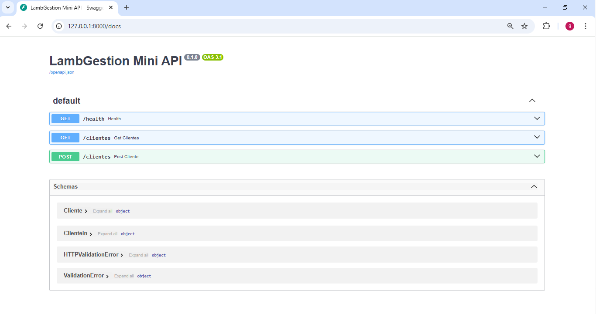

# LambGestion Mini API

Mini API REST en Python con FastAPI (demo de backend) para gestionar clientes.

## Features
- GET `/health` (estado del servicio)
- GET `/clientes` (listar clientes)
- POST `/clientes` (crear cliente)
- Documentación automática en `/docs`

## Requisitos
- Python 3.11+

## Instalación (Windows)
~~~powershell
python -m venv .venv
.venv\Scripts\activate
pip install -r requirements.txt
~~~

## Ejecutar
~~~powershell
uvicorn app.main:app --reload
~~~

## Uso
- Swagger UI: http://127.0.0.1:8000/docs
- Health: http://127.0.0.1:8000/health

### Ejemplo POST /clientes
Body (JSON):
~~~json
{
  "nombre": "Gonza",
  "email": "gonza@test.com"
}
~~~

